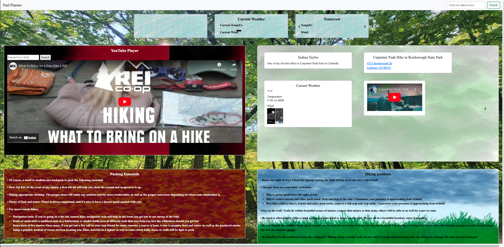

# Trail Planner
Work as a team to brainstorm an idea for an application, and build it together. Overcome the challenges of no longer working alone on a project, but working together on a collaborative project. Delegating various tasks, TODOs and features of a code amongst our group. 

## Description
Whether you are an avid hiker, or a newbiew who wants to get into hiking, you have mostlikey heard the importance of verifying the weather forcast, packing essential items, and researching the hiking route before you head out on your hike.  The importance of reseaching where you will hike, and the weather will allow you to prepare appropriate equipment and clothing.  This will allow you to enjoy your time outdoors and ensure your safety.  
## Usage
The web application will allow users to search specific hiking locations using the search tool on the top right of the page.  The auto complete feature will allow that user to complete their search more quikly.  The automated search feature will generate predictions that will help the user save time.  After the search is completed the current weather and future forcast will be displayed.  To reiterate, the purpose of this web application is to allow individual to plan a hike, all within one web application where the user can view current and future weather, know what one should pack, and hiking guidlines to ensure your hike is enjoyable.  
## Screenshot/Link

Screen Shot 2022-11-28 at 7.56.13 PM.png

link: https://josht-dev.github.io/trail-planner/

## Future Development

Add functionality to show maps and directions on the page for the searched hikes
Add an expanded hourly weather forecast for the selected hike
Add more extensive error checking and user notification for the National Weather Service API
Add filters and a random hiking video select to the YouTube player content on the page

## Credits

Youtube Data API
    https://developers.google.com/youtube/v3

Geoapify Autocomplete Tutorial
    Link to the tutorial: https://www.geoapify.com/tutorial/address-input-for-address-validation-and-address-verification-forms-tutorial

Dylan Casabona: https://github.com/DylanCas

Christian Loera Patron: https://github.com/ArticFox04

Ethyn Salazar: https://github.com/CrownClown014

